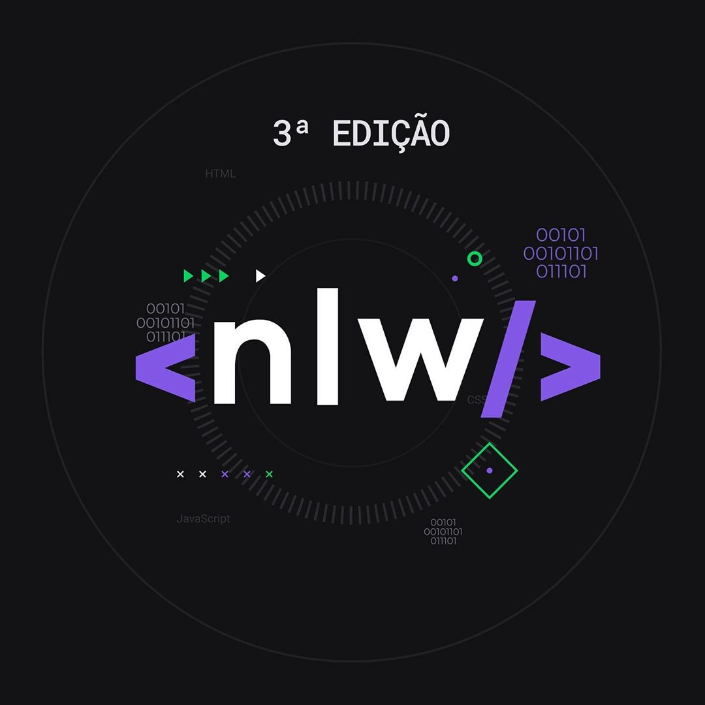
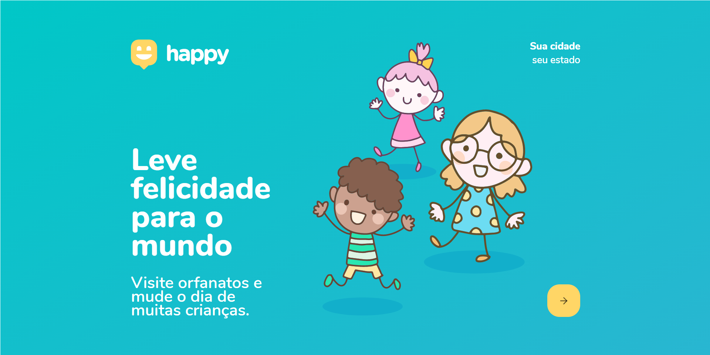

<h1 align="center">
    
</h1>

## 💻 Projeto

**Happy** é um projeto desenvolvido com base no dia das crianças. Com o objetivo de conectar pessoas e orfanatos, trazendo felicidade às crianças.
 ## 

<h1 align="center">
    
</h1>

## Tecnologias

Esse projeto foi desenvolvido pelas seguintes tecnologias: 

* Node.js
* TypeScript
* Express
* ReactJS
* React Native

## Como Usar

Para clonar e rodar essa aplicação será necessário [Git](https://git-scm.com/downloads) , [Node.js](https://nodejs.org/en/) + [Yarn](https://yarnpkg.com/) ou [Npm](https://www.npmjs.com/) instalados no seu computador.

No seu terminal digite o comando:

### Instalando API 

``` bash
# Clone esse repositorio
# $ git clone https://github.com/Soonas/Ecoleta.git

# Vá ao repositório
# $ cd nlw/backend

# Instale as dependências
$ npm install

## Crie o banco de dados

$ cd server
$ npm run typeorm migration:run

# Inicie a API
$ npm run dev

# Inicie a aplicação web
$ cd web
$ npm start

port 3333
```

## 🤔 Como contribuir:

* De uma ⭐; 
* Faça um fork; 
* Faça um push para o seu branch: `git push origin my-feature` .

Depois de mesclar sua solicitação de recebimento, você pode excluir o branch da sua.
  
